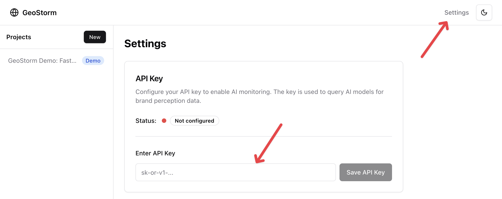

<div align="center">

# GeoStorm

### AI Perception Monitoring for Software

**Monitor how AI systems perceive and recommend your software across GPT, Claude, Gemini, and more.**

<p align="center">
  <a href="https://github.com/geostorm-ai/geostorm">
    
  </a>
  <a href="https://github.com/geostorm-ai/geostorm/actions/workflows/checks.yml">
    
  </a>
  <a href="https://github.com/geostorm-ai/geostorm/pkgs/container/geostorm">
    
  </a>
  <a href="https://github.com/geostorm-ai/geostorm?tab=contributing-ov-file">
    
  </a>
  <a href="https://github.com/geostorm-ai/geostorm?tab=MIT-1-ov-file">
    
  </a>
</p>

</div>

---

<table>
<tr>
<td>

**Developers increasingly discover software through AI** -- GPT, Claude, Gemini, Perplexity, and others. When someone asks "what's the best library for X?", the AI's answer shapes adoption. But you have no idea what these models are saying about your project.

GeoStorm monitors multiple AI models on a schedule, tracks how they perceive and recommend your software, and alerts you when things change -- a new competitor appears, your ranking drops, or a model stops mentioning you.

One container, one command.

</td>
</tr>
</table>

---

## Quick Start

```bash
docker run -d -p 8080:8080 -v geostorm-data:/app/data --name geostorm ghcr.io/geostorm-ai/geostorm
```

Open [http://localhost:8080](http://localhost:8080) -- the demo loads immediately.

No git clone, no build step, no API keys. A demo project with 90 days of synthetic monitoring data is ready to explore.

<details>
<summary><h3>Requirements</h3></summary>

- [Docker](https://docs.docker.com/get-docker/)
- An [OpenRouter](https://openrouter.ai/) API key (for querying AI models)

</details>

---

## What You'll See

The demo project ships with realistic sample data so you can explore every feature immediately:

| Feature | Description |
|---------|-------------|
| **Signal Panel** | A unified feed of alerts, ranked by severity and recency |
| **Alerts Feed** | Critical and warning signals with full context on what changed |
| **Perception Chart** | Track your recommendation share and positioning across models over time |

The demo data covers multiple AI models, competitor tracking, and trend analysis.

---

## Next Steps

To start monitoring your own software:

**1. Get an API key** at [OpenRouter](https://openrouter.ai/) -- one key gives you access to multiple AI models.

**2. Add your OpenRouter API key in the GeoStorm settings page:**



**3. Create a project** in the UI and GeoStorm starts monitoring on a schedule.

**4. (Optional) Connect Claude Code** so you can query your perception data conversationally:

```bash
claude mcp add --transport http geostorm http://localhost:8080/mcp/
```

Then ask Claude things like "What projects am I monitoring?", "Show me perception scores for Shotgun", or "Are there any alerts I should know about?"

---

## Alert Types

GeoStorm detects and alerts on these signals:

| Alert | Severity | Description |
|-------|----------|-------------|
| `competitor_emergence` | Critical | A new competitor has appeared in AI recommendations for your category |
| `disappearance` | Critical | Your software has stopped being mentioned by one or more AI models |
| `recommendation_share_drop` | Warning | Your share of AI recommendations has declined significantly |
| `position_degradation` | Warning | Your software is being listed lower in AI recommendation rankings |
| `model_divergence` | Warning | Different AI models are giving substantially different recommendations about your software |

---

## Architecture

GeoStorm runs as a single Docker container with no external dependencies:

| Component | Technology |
|-----------|-----------|
| **Backend** | FastAPI serving the REST API and running scheduled monitoring jobs via APScheduler (in-process) |
| **Frontend** | Astro with React islands, styled with TailwindCSS, charts powered by Recharts |
| **Database** | SQLite, stored in a mounted volume (`./data/`) |
| **Scheduling** | APScheduler runs inside the FastAPI process -- no separate worker, no Redis, no message queue |

One container, one port, one volume mount.

---

## MCP Integration (Claude Code)

GeoStorm exposes an [MCP](https://modelcontextprotocol.io/) endpoint at `/mcp/` so AI coding assistants like Claude Code can query your perception data conversationally. See [Next Steps](#next-steps) for the one-liner setup command.

To scope the MCP to a specific project directory instead of globally:

```bash
claude mcp add --transport http --scope project geostorm http://localhost:8080/mcp/
```

### Available Tools

| Tool | Description |
|------|-------------|
| `list_projects` | Discover project IDs, names, and latest scores |
| `get_project_summary` | Full project summary: detail, perception, breakdown, recent runs, and alerts (accepts ID or fuzzy name) |
| `get_run_detail` | Single run with perception score and competitors detected |
| `get_trajectory` | Historical trend data with day/week/month aggregation (accepts ID or fuzzy name) |

---

## Configuration

GeoStorm works out of the box with zero configuration. You can optionally configure notification channels via environment variables in a `.env` file:

| Channel | Description |
|---------|-------------|
| **Slack** | Set a webhook URL to receive alerts in a Slack channel |
| **Email** | Configure SMTP settings for email notifications |
| **Custom Webhook** | Point alerts at any HTTP endpoint |

All notification channels are optional. GeoStorm always displays alerts in the UI regardless of notification configuration.

### Telemetry

GeoStorm is free and open source. The only telemetry is an anonymous ping when the server starts and when a monitoring run completes — no names, no IPs, no project data. This helps us know the project is being used. You can [turn it off anytime](#how-do-i-disable-telemetry).

---

## Roadmap

Planned features, roughly in priority order:

- **Authentication** -- user accounts and login so GeoStorm can be hosted on a remote server or shared instance without exposing everything to the network
- **Direct provider support** -- use OpenAI, Anthropic, and Google API keys directly instead of going through OpenRouter
- **Expanded model coverage** -- automatic support for the latest models as they launch (Perplexity, Grok, etc.) so you're always monitoring against whatever people are actually using
- **Data export** -- CSV and PDF export of perception data, alerts, and run history
- **Raspberry Pi hosting guide** -- instructions for running GeoStorm on a Pi for always-on monitoring at home
- **Hosted version** -- a managed cloud option if there's enough demand for it

Have a feature request? [Open an issue](https://github.com/geostorm-ai/geostorm/issues/new).

---

## Contributing

GeoStorm is open-source and we welcome contributions.

### Ways to contribute:

- **Bug Report:** Found an issue? [Create a bug report](https://github.com/geostorm-ai/geostorm/issues/new)
- **Feature Request:** Have an idea? [Submit a feature request](https://github.com/geostorm-ai/geostorm/issues/new)
- **Pull Request:** PRs are welcome -- fork, branch, and open a PR

### Development Setup

```bash
# Run locally with a local build
docker compose -f docker-compose.yml -f docker-compose.dev.yml up -d --build

# Backend checks
uv sync --frozen --all-extras
uv run ruff check .
uv run mypy src/ --strict
uv run pytest tests/ -v

# Frontend checks
cd web && pnpm install --frozen-lockfile
pnpm astro check
pnpm tsc --noEmit
```

#### Structured Logging (Optional)

GeoStorm uses [Logfire](https://logfire.pydantic.dev/) for structured logging. Console logs work out of the box with no extra setup. To also send telemetry to Logfire cloud during development, set `LOGFIRE_TOKEN` in your environment.

---

## FAQ

<details>
<summary><strong>Why would I want this?</strong></summary>
<br>

More developers discover tools by asking AI -- "what's the best library for X?" If a model stops recommending your project or starts favoring a competitor, you'd never know unless you manually checked. GeoStorm automates that and alerts you when something changes.

</details>

<details>
<summary><strong>Why OpenRouter?</strong></summary>
<br>

OpenRouter gives you access to GPT, Claude, Gemini, Llama, and dozens of other models through a single API key. Instead of managing separate keys for OpenAI, Anthropic, and Google, you sign up once and GeoStorm can query all of them. You can also use direct provider keys (`OPENAI_API_KEY`, `ANTHROPIC_API_KEY`, `GOOGLE_API_KEY`) if you prefer.

</details>

<details>
<summary><strong>Is there a hosted version?</strong></summary>
<br>

Not yet. GeoStorm is self-hosted only for now. The Docker container is designed to be easy to run anywhere -- your laptop, a VPS, or a cloud VM. A hosted version is on the roadmap.

</details>

<details>
<summary><strong>Why SQLite?</strong></summary>
<br>

GeoStorm is a single-user monitoring tool, not a multi-tenant SaaS. SQLite keeps things simple -- no database server to run, no connection strings to configure. Your data lives in a single file on a mounted volume. For GeoStorm's query patterns, SQLite is more than fast enough.

</details>

<details>
<summary><strong>How much does it cost to run?</strong></summary>
<br>

GeoStorm itself is free. The only cost is the AI API usage through OpenRouter. A typical monitoring run queries 3 models with a few prompts each -- roughly $0.01-0.05 per run depending on the models you choose. Running daily, that's about $1-2/month.

</details>

<details>
<summary><strong>Couldn't I do this with OpenClaw?</strong></summary>
<br>

You could wire up an OpenClaw agent with a cron job to query AI models daily and store the results somewhere. But then you're building GeoStorm from scratch -- prompt engineering for consistent structured responses, parsing and normalizing across models, calculating recommendation share and position rankings, detecting changes over time, generating alerts, and building a UI to make sense of it all.

GeoStorm does all of that out of the box. It's also cheaper and more predictable -- deterministic code on a fixed schedule, so you know what queries run and what they cost. An AI agent deciding what to do each run can drift or burn tokens on reasoning overhead. No agent framework required.

</details>

<details>
<summary><strong>How do I disable telemetry?</strong></summary>
<br>

Set the `NO_TELEMETRY=true` environment variable. This completely disables all analytics — no PostHog client is created and no events are sent. See [PRIVACY.md](PRIVACY.md) for full details on what is (and isn't) collected.

```bash
# Docker
docker run -e NO_TELEMETRY=true ...

# .env file
NO_TELEMETRY=true
```

</details>

---

<div align="center">

### Get started

```bash
docker run -d -p 8080:8080 -v geostorm-data:/app/data --name geostorm ghcr.io/geostorm-ai/geostorm
```

<a href="https://github.com/geostorm-ai/geostorm">
  
</a>

</div>

---

**License:** MIT | **Python:** 3.11+ | **Homepage:** [github.com/geostorm-ai/geostorm](https://github.com/geostorm-ai/geostorm)
